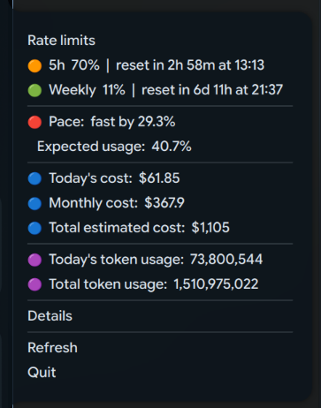

# StatusBar Codex Linux

<div align="center">
  
</div>

Um applet nativo de **bandeja do sistema Linux** que exibe o uso do Codex diretamente na barra superior.

## Instalação

```bash
curl -fsSL https://raw.githubusercontent.com/kevintestegit/StatusBar-Codex-Linux/main/install.sh | sh
```

O script pergunta (Y/n) antes de instalar Rust e deps do sistema.

<div align="center">
  
  <br>
  <em>Menu suspenso com rate limits, custos, tokens e configurações</em>
</div>

Na barra do sistema (topo da tela), o app mostra um label como `5h 1% | $0.00` — o percentual do limite de 5 horas e o custo estimado do dia. A cor do ícone muda dinamicamente (verde → amarelo → vermelho) conforme o uso aumenta.

## Como funciona

O app lê arquivos JSONL de sessão do Codex em disco, analisa eventos `token_count` e `rate_limits`, e exibe na bandeja:

- **Limites de taxa** — uso da janela de 5h e semanal, com contagem regressiva para reset
- **Custo estimado** — equivalente API pública por dia, mês e total histórico
- **Consumo por modelo** — breakdown de tokens input/cached/output/reasoning por modelo (GPT-5, GPT-5.4, etc.)
- **Ritmo de uso** — se está dentro do esperado ou queimando o limite muito rápido
- **Notificações desktop** — alerta quando o limite reseta ou o ritmo está acelerado
- **Modo festa** — overlay fullscreen com confete Cairo quando o limite semanal reseta

### Arquitetura

```
~/.codex/sessions/*.jsonl
         │
         ▼
  ┌─────────────────┐
  │  Parse JSONL    │  ───  lê eventos token_count e rate_limits
  │  (walkdir)      │
  └──────┬──────────┘
         │
         ▼
  ┌─────────────────┐
  │  Aggregate      │  ───  agrupa por modelo, dia, mês
  │  (HashMap)      │
  └──────┬──────────┘
         │
         ▼
  ┌──────────────────────┐
  │  GTK3 AppIndicator   │  ───  label "5h 1% | $0.00" na bandeja
  │  + menu com detalhes │       menu com rate limits, custos, refresh
  │  + Cairo confete     │       notificações e modo festa
  └──────────────────────┘
         │
         ▼
    Bandeja do sistema Linux
    "5h 1% | $0.00"
```

### Fontes de dados

1. **App server live** (primário) — usa `codex app-server --listen stdio://` via JSON-RPC para buscar `account/rateLimits/read` em tempo real
2. **JSONL local** (fallback) — lê `$CODEX_HOME/sessions/` ou `~/.codex/sessions/` quando o app server não responde
3. **Cache de arquivos** — cada arquivo JSONL é cacheado por tamanho + timestamp; só reparsa se mudou

### Modos de execução

| Flag | Descrição |
|------|-----------|
| _(sem flag)_ | Abre o tray icon e fica em background |
| `--once` | Imprime resumo no terminal e sai |
| `--html` | Gera dashboard HTML completo no stdout |
| `--test-5h-reset` | Simula notificação de reset 5h |
| `--test-weekly-reset` | Simula notificação de reset semanal + confete |
| `--test-pace-alert` | Simula alerta de ritmo acelerado |

### Funcionalidades

- **Label na bandeja**: `"5h 1% | $0.00"` — visível direto na barra do sistema
- **Ícone com cor dinâmica**: verde → amarelo → vermelho conforme o percentual de uso
- **Menu suspenso**: rate limits, custos, tokens, modo festa, intervalo de refresh
- **Notificações desktop**: quando uma janela de taxa reseta ou o ritmo está acelerado
- **Modo festa**: overlay fullscreen com confete Cairo via GTK Layer Shell
- **Dashboard HTML detalhado**: tabela por modelo com input/cached/output/reasoning/custo
- **Cache inteligente**: não reparsa arquivos JSONL inalterados
- **Ícones SVG**: gerados dinamicamente em `/tmp/StatusBar-Codex-Linux-icons/`

### Configuração

Arquivo: `~/.config/StatusBar-Codex-Linux/config.json`

```json
{
  "party_mode": false,
  "refresh_seconds": 30
}
```

Ajustável via menu da bandeja (5s, 15s, 30s, 1min, 5min).

### Build

```bash
# Dependências (Debian/Ubuntu)
sudo apt install cargo pkg-config libgtk-3-dev \
  libayatana-appindicator3-dev libgtk-layer-shell-dev

cargo build --release
./target/release/StatusBar-Codex-Linux
```

### Dashboard detalhado

Além do label na bandeja, o app gera um dashboard HTML completo com tabela por modelo, breakdown de tokens e custos:

<div align="center">
  
  <br>
  <em>Dashboard HTML com rate limits, custos e breakdown por modelo</em>
</div>

### Stack

- **Rust** — binário nativo, sem runtime web
- **GTK3** — menu, labels, janelas
- **Ayatana AppIndicator** — integração com bandeja Linux
- **GTK Layer Shell** — overlay Wayland para modo festa
- **Cairo** — desenho de confete
- **JSONL parsing** — leitura local de sessões Codex

### Privacidade

O app **não envia dados para lugar nenhum**. Lê apenas arquivos locais em `$CODEX_HOME/sessions` ou `~/.codex/sessions`. Sem telemetria, sem rede, sem banco de dados.
